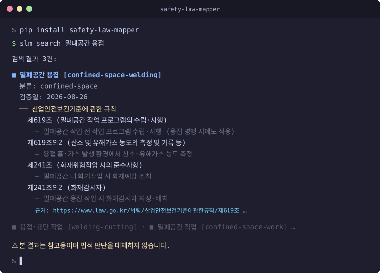
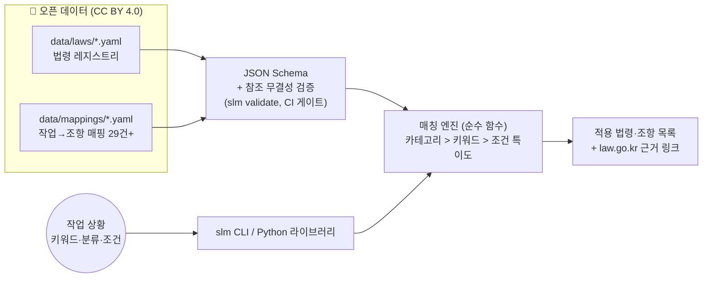

# safety-law-mapper (안전법규 매핑 엔진)

[](https://pypi.org/project/safety-law-mapper/)
[](https://github.com/acceptha/safety-law-mapper/actions/workflows/ci.yml)
[](https://pypi.org/project/safety-law-mapper/)
[](LICENSE)
[](LICENSE-DATA)

**"이 작업에 어떤 법이 적용되는가?" — 작업 상황을 입력하면 적용되는 한국 안전 법령·조항을 찾아주는 규칙 기반 오픈소스 매핑 엔진**



> 🔎 **설치 없이 바로 체험**: [웹 데모](https://acceptha.github.io/safety-law-mapper/) — CLI와 동일한 매칭 엔진을 브라우저에서 실행합니다.

> ⚠️ **본 도구는 법률 자문이 아닙니다.** 모든 결과는 참고용이며 법적 판단을 대체하지 않습니다.

## 왜 만들었나

산재 사고사망의 다수는 소규모 사업장에서 발생합니다. 대기업은 전담 안전조직이 있지만, 영세 사업장은 "이 작업에 어떤 법이 적용되는지" 판단할 사람이 없습니다. 법령 원문은 공개돼 있어도 **"내 상황에 적용되는 조항"이라는 해석은 사실상 유료 전문가의 영역**이었습니다.

기존 도구는 전부 "법령 → 내용" 방향의 검색입니다:

| 도구 | 제공 기능 | 한계 |
|---|---|---|
| [국가법령정보센터](https://www.law.go.kr) | 법령 원문 조회의 표준 | 조문을 읽는 도구. "내 작업에 뭐가 적용되나"는 답하지 않음 |
| KOSHA 안전보건법령 스마트검색 | 산안법·기준규칙 통합 전문 검색 | 키워드가 포함된 조문을 찾을 뿐, 작업에 적용되는 조항 "목록"을 반환하지 않음 |
| 실무 조회표 사이트 | 선임대상·과태료 등 정적 표 | 조합 조건(작업×규모×물질) 질의 불가 |

이 프로젝트는 **"작업 상황 → 적용 조항"이라는 역방향 매핑**을 구조화된 오픈 데이터(YAML)로 만들고, 이를 검색하는 CLI/라이브러리를 제공합니다. 핵심 자산은 코드가 아니라 **커뮤니티가 함께 검증하는 매핑 데이터**입니다.

## 동작 구조



- **규칙 기반, AI 추론 배제** — 명시적 데이터로만 답하므로 왜 그 법이 적용되는지 누구나 검증·수정(PR)할 수 있습니다.
- **인용은 절대 지어내지 않습니다** — 모든 조항에 `source_url`(law.go.kr) 필수, 사람이 원문 대조한 날짜를 `last_verified`로 기록. 미검증 항목은 CLI에 "미검증 (사람 검토 필요)"로 표시됩니다.
- **CI가 데이터 품질의 1차 방어선** — 스키마·법령 FK·날짜 무결성 검사와 골든 쿼리 회귀 테스트("밀폐공간 용접 검색엔 반드시 제619조 포함")가 모든 PR에서 실행됩니다.

## 설치·사용

```bash
pip install safety-law-mapper   # Python 3.11+
```

```bash
# 키워드로 적용 법령·조항 검색
slm search 밀폐공간 용접

# 작업 분류·근로자 수 조건 추가
slm search 용접 --category hot-work --employees 30

# 매핑 상세 조회 / 데이터 검증
slm show confined-space-welding
slm validate
```

종료 코드: `0` 정상, `1` 결과 없음, `2` 검증 오류.

### 라이브러리로 사용

```python
from safety_law_mapper.loader import load_dataset
from safety_law_mapper.matcher import Query, match

ds = load_dataset()
results = match(list(ds.mappings.values()), Query(keywords=["밀폐공간", "용접"]))
for r in results:
    print(r.mapping.work_type.name_ko, r.score)
```

## 데이터 현황

고위험 작업 유형 **29종** 매핑 (11개 카테고리 전부 커버): 밀폐공간, 용접·용단, 밀폐공간×용접(조합), 고소작업, 지게차, 크레인, 타워크레인 설치·해체, 굴착, 굴착기, 전기, 비계, 사다리, 중량물, 컨베이어, 프레스, 연삭기, 산업용 로봇, 항타기, MSDS 화학물질, 위험물질·도장(교차 인용), 석면 해체, 소음, 고열·폭염(2025년 신설 규정 반영) 등 — 전 조항 [국가법령정보센터](https://www.law.go.kr) 원문 대조 검증 완료.

## 기여하기

**매핑 1건 추가가 이 프로젝트에서 가장 가치 있는 기여입니다.** 템플릿 복사 → law.go.kr 대조 → `slm validate` → PR, 10분이면 시작할 수 있습니다.

- 👉 [기여 가이드 (CONTRIBUTING.md)](docs/CONTRIBUTING.md)
- 👉 [good first issue 목록](https://github.com/acceptha/safety-law-mapper/issues?q=is%3Aissue+is%3Aopen+label%3A%22good+first+issue%22)

## 로드맵

| 단계 | 내용 | 상태 |
|---|---|---|
| 1단계 | 매핑 데이터 + CLI/라이브러리 + 검증 파이프라인 + PyPI 배포 + 웹 데모 | ✅ v0.2.0 |
| 2단계 | 사업장 프로필 → 의무사항 체크리스트 자동 생성 | 계획 |
| 3단계 | 법령 개정 자동 추적 + 영향받는 매핑 알림 | 계획 |
| 장기 | Safety-as-Code (`slm plan`) · 안전 AI 서비스의 표준 grounding 데이터 | 비전 |

## 라이선스

- 코드: [MIT](LICENSE)
- 데이터 (`data/`): [CC BY 4.0](LICENSE-DATA)

---

⚠️ 본 결과는 참고용이며 법적 판단을 대체하지 않습니다.
