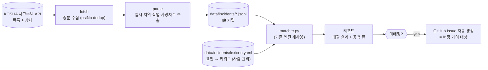

# 사고속보 연계 기획서 — KOSHA 사고속보 → 매핑 데이터 공백 탐지

> 상태: **기획 (미구현)** | Version 0.1 | 작성일 2026-08-27
> 관련 문서: `PROJECT_SPEC.md`, `안전법규-매핑엔진-기획서.md`, `docs/CONTRIBUTING.md`
> ⚠️ 이 문서는 구현 승인 문서가 아닙니다. 착수 전 `PROJECT_SPEC.md` §0 SCOPE GUARD 갱신이 선행되어야 합니다.

---

## 1. 배경과 문제

현재 `slm`은 **사용자가 키워드를 알고 있어야** 답을 주는 pull 방식입니다. 그런데 정작 답해야 할 질문은 반대 방향입니다 — **"지금 현장에서 실제로 사람이 죽고 있는 작업에, 우리 데이터가 답을 갖고 있는가?"**

매핑 데이터는 지금까지 사람의 직관으로 늘려 왔습니다. 29종 매핑 중 `carwash-operation`은 기여자가 우연히 떠올려 추가한 항목입니다. 이 방식은 두 가지 문제가 있습니다:

1. **무엇이 빠졌는지 알 수 없다** — 없는 매핑은 검색해도 안 나오므로, 공백은 스스로를 드러내지 않습니다.
2. **우선순위가 없다** — 다음에 추가할 매핑 1건이 연 1건짜리 작업인지 연 20건짜리 작업인지 판단할 근거가 없습니다.

KOSHA **사고속보**(산업안전포털)에는 사망사고가 발생 며칠 내로 게시됩니다. 이것을 매핑 데이터에 대조하면 **공백이 빈도순으로 정렬되어 드러납니다.** 이 기획의 목적은 그 대조를 자동화하는 것입니다.

---

## 2. 목표와 비목표

### 목표

| # | 목표 | 성공 기준 |
|---|---|---|
| G1 | 사고속보 자동 수집·보관 | 일 1회 무인 실행, 신규 게시물 누락 0건, pstNo 기준 중복 0건 |
| G2 | 사고 → 기존 매핑 자동 후보 매핑 | 최근 300건 기준 오탐률 5% 이하 (§4.3 현재 방식은 오탐 다수) |
| G3 | 미매핑 사고를 **빈도순 공백 큐**로 노출 | 리포트 상위 항목이 곧 다음 매핑 기여 대상 |

### 비목표 — 명시적 금지 사항

이 셋은 편의를 위해서도 완화하지 않습니다.

- **🚫 법령 조문 자동 생성·추론 금지.** 자동화 범위는 `수집 → 후보 매핑 → 공백 탐지`까지입니다. 조문(`applicable_laws`)은 지금처럼 사람이 law.go.kr 원문을 대조하고 `last_verified`·`verified_by`를 기록해 PR로만 추가합니다. 이 프로젝트의 신뢰 근거가 "인용을 지어내지 않는다"인데, 자동 생성은 그 근거를 정면으로 무너뜨립니다.
- **🚫 위반 조항 판정 금지.** 산출물은 "이 사고에서 **위반된** 조항"이 아니라 **"이 작업 유형에 적용되는 조항"**입니다. 사고속보는 조사 전 신고 단계 정보이고(원문에도 *"조사결과에 따라 변경될 수 있습니다"* 명시), 특정 사업장의 법 위반을 단정하는 것은 이 도구의 권한 밖이며 명예훼손 소지가 있습니다. 모든 산출물에 이 경계를 문구로 표기합니다.
- **🚫 재해자 개인정보 수집 금지.** 사고속보 원문에는 개인 식별정보가 없습니다(사망자 수만 기재). 향후 원문 형식이 바뀌어 개인정보가 포함되면 수집을 중단합니다.

---

## 3. 데이터 소스 조사 결과 (2026-08-27 실측)

### 3.1 페이지

`https://portal.kosha.or.kr/business-apply-search/etc-biz/acc-invest-act/cont2` (사업신청·조회 › 기타사업 조회 › 사고감시 및 대응 › 사고속보)

SPA이며 HTML에 목록이 없습니다. 내부 API를 직접 호출합니다. **인증·쿠키·토큰 불필요** (익명 호출로 검증 완료).

### 3.2 API 계약

공통: `POST https://portal.kosha.or.kr/api/compn24/auth/stdtboard/process.do`
`Content-Type: application/x-www-form-urlencoded`
본문: `_JSON=` + **이중 URL 인코딩된** JSON (`encodeURIComponent(encodeURIComponent(json))`)

**목록** — `serviceId: "basicAccess"`

```jsonc
{ "common": { "frontInfo": {"viewId":"","menuId":"","siteId":""}, "frontAuthKey":"", "auth":{}, "securityInfo":{},
    "data": { "pagingInfo": null, "whereId": null,
      "tboard": { "systemCd":"20", "channel":"web", "bbsId":"B2025021314108", "bbsGrpId":"", "serviceId":"basicAccess" } } },
  "service": { "info": {"id":"","type":""},
    "data": { "searchDefaultCndGrid": [ {
        "orPstNm":"", "orPstCn":"", "curPageCo":1, "recodePageCo":12, "rowsPerPage":12,
        "pstSeCd":"1200001", "atcflCntSrchYn":"Y", "artclNoList":[],
        "pstNoOrder":"Y", "isDesc":"Y", "sortType":"01", "sortOrder":"1", "isAddPstCn":"N" } ],
      "searchArtclCndGrid": [] } } }
```

응답 `response.bbsPstGrid[]` → `pstNo`, `pstNm`(제목), `regYmd`(등록일 `YYYYMMDD`), `frstRegDt`(등록일시 `YYYYMMDDhhmmss`), `wrtrNm`. `response.totalCnt` = **2,921** (2026-08-27 기준).

> ⚠️ 목록 응답의 `pstCn`(본문)은 `isAddPstCn:"Y"`를 줘도 `null`입니다. 본문은 상세 호출로만 얻습니다.

**상세** — `serviceId: "basicRead"`, `service.data.pstDefaultGrid: [{ "bbsId": "B2025021314108", "pstNo": "<pstNo>" }]`
응답 `response.bbsDetailInfo[0].pstCn` = 본문 HTML.

**원문 permalink** (SPA가 push하는 URL, 안정적):
`https://portal.kosha.or.kr/business-apply-search/etc-biz/acc-invest-act/cont2?bbsId=B2025021314108&pstNo=<pstNo>`

### 3.3 본문에 실제로 담기는 정보

제목보다 훨씬 풍부합니다. 태그 제거 후 예시:

```
2026. 8. 19 (수), 14:08경
부산 강서구 소재 공사현장에서
재해자가 이동식 비계 상부에 올라 천장 표면 마감 작업 중
이동식 비계가 넘어지며 떨어짐 (1.8m) (사망1명)
※ 위 내용은 신고 및 현재 파악된 내용으로 조사 결과에 따라 변경될 수 있습니다.
```

추출 가능한 구조화 필드: **사고일시**(분 단위), **지역**, **현장 유형**(공사현장/공장 등), **작업 내용**, **사고 경위**, **추락 높이**, **사망자 수**.

제목만 쓰면 `이동식 비계가 넘어져 떨어짐`이지만, 본문은 `천장 표면 마감 작업`이라는 **작업 맥락**을 줍니다. 매핑 정확도는 본문 사용 여부에서 갈립니다 → **상세 호출을 필수로 포함합니다.**

### 3.4 갱신 특성 — "실시간"은 불가능

게시가 **부정기**입니다. 2026-08-27에 8/19·8/23·8/24 사고가 한꺼번에 3건 올라왔습니다. 사고일과 게시일 사이 지연은 **3~8일**로 관측됩니다.

따라서 폴링 주기를 올려도 신선도가 개선되지 않습니다. **일 1회 cron이 실질적 상한**이며, 이를 "실시간"이라 표현하지 않습니다.

---

## 4. 현황 분석 — 최근 300건 실측

수집 표본: 최근 300건, 등록일 **2025-08-29 ~ 2026-08-27** (약 1년). 전체 2,921건 중 최신 10%.

### 4.1 사고 유형 분포 (제목 기준, 중복 계수)

| 유형 | 건수 | 유형 | 건수 |
|---|---:|---|---:|
| 떨어짐 | 125 | 폭발 | 7 |
| 깔림 | 52 | 매몰 | 6 |
| 끼임 | 39 | 붕괴 | 5 |
| 맞음 | 32 | 감전 | 4 |
| 부딪힘 | 22 | 쓰러짐 | 4 |
| | | 화상·질식·화재·넘어짐 | 7 |

**떨어짐이 42%로 압도적**입니다. 이는 매핑 데이터의 우선순위와 직결됩니다(§4.4).

### 4.2 현재 데이터의 매칭률

기존 29종 매핑의 `work_type.keywords`를 제목에 단순 포함 검사한 결과:

| 조건 | 매칭 | 미매칭 |
|---|---:|---:|
| 전체 키워드 사용 | 201 (67%) | 99 (33%) |
| 범용어 10개 제외* | **169 (56%)** | **131 (44%)** |

\* 제외한 범용어: `제거`, `설치`, `해체`, `조립`, `운반`, `작업`, `점검`, `정비`, `전기`, `화물`

위 두 줄의 차이(32건)가 곧 **범용어로만 매칭된 건수**이며, 이들이 §4.3의 오탐 후보입니다. 이후 분석은 보수적으로 범용어 제외 기준(미매칭 131건)을 사용합니다.

### 4.3 현재 방식의 오탐 — 렉시콘이 필요한 이유

범용어를 그대로 두면 매칭률은 올라가지만 **틀린 답**이 섞입니다:

| 사고 | 잘못 매칭된 항목 | 원인 |
|---|---|---|
| 설비 내 **슬러지 제거** 중 스크류에 끼임 | `asbestos-removal` (석면 해체) | `제거` |
| **만국기 설치** 준비 중 떨어짐 | `tower-crane-assembly` (타워크레인 설치·해체) | `설치` |
| 창호틀 **해체**작업 중 단부로 떨어짐 | `asbestos-removal` | `해체` |

법령 매핑에서 오탐은 미매칭보다 해롭습니다. 사용자가 관계없는 조항을 검토하게 만들고, 도구 신뢰를 떨어뜨립니다. → **§5.3 렉시콘으로 표현–키워드 대응을 명시적으로 관리합니다.**

### 4.4 공백 Top — 미매칭 131건의 군집 분석

한 사고가 여러 표현을 포함하므로, 아래는 **표현 빈도가 아니라 사고 건수**입니다(중복 제거, 위에서부터 우선 배정).

| 순위 | 공백 군집 | 사고 건수 | 미매칭 대비 | 공백 유형 |
|---:|---|---:|---:|---|
| 1 | **지붕·채광창·판넬 작업** | **27** | 21% | B — 매핑 부재 |
| 2 | **차량계 하역운반기계** (화물차·적재함·적재기) | **13** | 10% | B — 매핑 부재 |
| 3 | 기계류 (성형기·둥근톱·교반기·압축기·회전체) | 9 | 7% | B — 기계별 매핑 부재 |
| 4 | 밀폐공간 동의어 (정화조·저수조·배관실·슬러지) | 7 | 5% | A — 동의어 누락 |
| 5 | 거푸집·동바리·갱폼 | 3 | 2% | B — 매핑 부재 |
| 6 | 단부·난간 | 3 | 2% | A — `work-at-height` 동의어 누락 |
| 7 | 승강기·곤돌라·권양기 | 1 | 1% | B — 매핑 부재 |
| — | 군집 미형성 (개별 사례) | 68 | 52% | 추가 분석 필요 |

상위 7개 군집이 미매칭의 **48%(63건)**를 설명합니다. 나머지 68건은 단발성 표현이라 렉시콘 설계 시 무리하게 규칙화하지 않습니다(§8 과적합 리스크).

### 4.5 측정 방식의 한계 — 일부 "공백"은 측정 오차였음 (2026-08-28 정정)

위 분석은 `매핑 키워드가 사고 제목에 포함되는가`라는 **단방향** 검사입니다. 그런데 실제 `matcher.py`는 **양방향 부분일치**(`qk in ek or ek in qk`)를 합니다. 따라서 단방향 스캔이 놓친 항목 중 일부는 **CLI에서는 이미 정상 동작**합니다.

실제 matcher로 재확인한 결과:

| 키워드 | 단방향 스캔 | 실제 `slm search` | 판정 |
|---|---|---|---|
| `숫돌` | 미매칭 (`연삭숫돌` ⊄ `연삭 숫돌`) | ✅ `grinder-work` | 측정 오차 |
| `난간` | 미매칭 (`안전난간` ⊄ `베란다 난간`) | ✅ `work-at-height` | 측정 오차 |
| `정화조`·`침전조`·`집수조` | 미매칭 | ❌ 결과 없음 | **진짜 공백** |
| `단부` | 미매칭 | ❌ 결과 없음 | **진짜 공백** |

**교훈:** 수집기 구현 시 공백 판정은 반드시 **`matcher.match()`를 호출**해야 하며, 문자열 포함 검사로 대체하면 없는 공백을 만들어냅니다. §5.4 신뢰도 판정도 matcher 결과를 기준으로 합니다.

### 4.6 조치 결과 (2026-08-28)

이 분석을 근거로 아래를 적용했고, 동일 표본 300건 기준 매칭률이 **56% → 66%**로 올랐습니다(미매칭 131 → 102건).

- `roof-work` 매핑 신규 작성 — 최대 공백 해소 (기준규칙 제45조 외 4개 조항, law.go.kr 대조 완료)
- `confined-space-work`에 `정화조`·`침전조`·`집수조`·`슬러지` 키워드 추가 (별표18 제11호 근거)
- `work-at-height`에 `단부` 키워드 추가 (제43조 "통로의 끝" 근거)

즉 **수집 자동화 없이도 이 기획의 목표 G3(공백 발견)는 1회성 분석만으로 이미 가치를 냈습니다.** 자동화는 이 과정을 반복 가능하게 만드는 것이 목적입니다.

**공백은 두 종류이고 처방이 다릅니다:**

- **유형 A — 동의어 누락.** 매핑은 있는데 원문 표현이 키워드에 없음.
  예: `깨진 연삭 숫돌 파편에 맞음` → `grinder-work`의 키워드는 `연삭숫돌`(붙여쓰기)이라 미스. `양돈농장 정화조` → `confined-space-work`에 `맨홀`·`탱크`는 있으나 `정화조` 없음. `단부로 떨어짐` → `work-at-height`에 `개구부`는 있으나 `단부` 없음.
  → **렉시콘 동의어 1줄로 해결.** 조문 검증 불필요, 비용 거의 0.
- **유형 B — 매핑 부재.** 작업 유형 자체가 데이터에 없음.
  → **새 매핑 YAML 작성 필요.** law.go.kr 조문 대조가 들어가므로 세차장 수준의 작업량(건당 수 시간).

**지붕 작업이 단일 최대 공백입니다** — 미매칭의 21%, 전체 표본 300건의 **9%**. 약 1년간 27건이 사망사고로 게시되는 동안 현재 데이터에는 해당 작업 유형이 아예 없습니다. 반복되는 패턴도 뚜렷합니다: *채광창을 밟고 떨어짐*(7건), *지붕 보수·교체 중 떨어짐*, *태양광 설치 중 떨어짐*. 다음 매핑 기여 1순위입니다.
(조문은 작성 시 law.go.kr 원문 대조로 확정합니다 — 이 문서에 조문 번호를 미리 적지 않습니다.)

---

## 5. 설계

### 5.1 파이프라인



기존 `matcher.py`를 그대로 재사용합니다. 사고속보 연계는 **matcher 앞단의 질의 생성기**일 뿐이며, 매칭 엔진과 법령 데이터는 손대지 않습니다.

### 5.2 사고 레코드 스키마 — `data/incidents/kosha-alerts.jsonl`

1행 1사고, `pstNo` 기준 append-only.

```jsonc
{
  "pst_no": "202608271115034T7HCQ",          // KOSHA 고유 ID = 중복 판정 키
  "posted_at": "2026-08-27",                  // regYmd — 게시일
  "occurred_at": "2026-08-19T14:08",           // 본문 파싱, 실패 시 null
  "region": "부산 강서구",
  "site_type": "건설현장",                     // 통제 어휘 (§5.2.2)
  "accident_type": ["떨어짐"],                 // 통제 어휘 (§5.2.1)
  "fatalities": 1,
  "fall_height_m": 1.8,                        // 없으면 null
  "work_keywords": ["비계", "작업발판"],        // 우리 어휘(렉시콘·매핑 키워드)로만 구성
  "source_url": "https://portal.kosha.or.kr/…&pstNo=202608271115034T7HCQ",
  "fetched_at": "2026-08-28",
  "title": "[8/19, 부산 강서구] 이동식 비계가 넘어져 떨어짐"   // 선택 — §6.1
}
```

두 가지가 §5.2 초안에서 바뀌었습니다:

- `work_summary`(본문 발췌) → **`work_keywords`**. 발췌는 원문 표현을 그대로 담지만, 키워드는 **이 저장소가 이미 소유한 어휘**(렉시콘 타깃 + 매핑 키워드)에서만 나옵니다. 저작권 판단에 의존하지 않으면서 매칭에 필요한 정보는 모두 보존합니다.
- `title`은 **선택 필드**입니다. 기본은 저장이지만 `--no-store-titles`로 끌 수 있습니다 (§6.1).

> **본문 전문(`pstCn`)은 커밋하지 않습니다.** 재처리를 위해 `data/incidents/.cache/`에 로컬 사본을 두되 `.gitignore` 대상입니다. 덕분에 렉시콘을 고칠 때마다 KOSHA를 다시 호출하지 않고 `--reprocess`로 오프라인 재생성합니다.

#### 5.2.1 `accident_type` 통제 어휘

`떨어짐`, `깔림`, `끼임`, `맞음`, `부딪힘`, `넘어짐`, `감전`, `화상`, `질식`, `붕괴`, `매몰`, `화재`, `폭발`, `빠짐`, `기타`
(고용노동부 재해 발생형태 분류와 사고속보 제목 실사용 표현을 절충. 스키마에 enum으로 강제.)

#### 5.2.2 `site_type` 통제 어휘

`건설현장`, `제조업`, `농림축산`, `창고·물류`, `환경·폐기물`, `건물·시설`, `서비스·판매`, `기타`

표준 산업분류를 그대로 쓰지 않고 **사고속보 300건에 실제로 나타난 표현에서 귀납**했습니다(`제조업 사업장` 58건, `공사현장` 57건 등 고유 표현 146종). 원문 문구는 저장하지 않고 분류 결과만 남깁니다 — `work_keywords`와 같은 원칙(§6.1).

### 5.3 렉시콘 — `data/incidents/lexicon.yaml`

사고속보 표현을 매핑 키워드로 옮기는 **사람이 관리하는 사전**입니다. 자동 학습하지 않습니다.

```yaml
# 사고속보 원문 표현 → 매핑 질의로 사용할 키워드
terms:
  - surface: [연삭 숫돌, 연삭숫돌, 그라인더 숫돌]
    keywords: [연삭기]
    note: 원문은 띄어쓰기 변동이 큼

  - surface: [정화조, 저수조, 집수정, 오수조]
    keywords: [밀폐공간]
    category: confined-space

  - surface: [단부, 슬래브 단부]
    keywords: [개구부, 추락]
    category: work-at-height

# 매칭에서 제외할 범용어 — 단독 출현 시 신호로 쓰지 않음 (§4.3 오탐 방지)
stopwords: [제거, 설치, 해체, 조립, 운반, 작업, 점검, 정비, 전기, 화물, 사고, 재해]
```

- `surface` 매칭은 **stopword 단독 매칭을 무효화**하고, 두 개 이상 신호가 있을 때만 후보로 승격합니다.
- 렉시콘 항목 추가는 **조문 검증이 필요 없으므로** 매핑 YAML 추가보다 진입장벽이 훨씬 낮습니다 → 신규 기여자의 첫 PR 소재로 적합 (`good first issue`).

### 5.4 매핑 신뢰도 — 3단계

산출물은 확정과 추정을 절대 섞지 않습니다.

| 단계 | 조건 | 표기 |
|---|---|---|
| **확정** | 렉시콘 `surface` 정확 일치 또는 매핑 키워드 정확 일치 | `적용 법령` |
| **후보** | 부분 일치·카테고리만 일치 | `후보 (사람 확인 필요)` |
| **미매핑** | 신호 없음 또는 stopword만 매칭 | `미매핑 → 공백 큐 등록` |

**미매핑을 억지로 매칭하지 않습니다.** 미매핑은 실패가 아니라 이 시스템의 **주 산출물**입니다.

### 5.5 CLI

```bash
slm incidents                      # 최근 사고 + 적용 법령 (미매핑은 ⚠️ 표시)
slm incidents --gaps               # 미매핑만, 빈도순 — 공백 큐
slm incidents --since 2026-08-01   # 기간 필터
slm incidents --type 떨어짐         # 사고유형 필터
```

출력에는 기존 `DISCLAIMER`에 더해 **§2 비목표의 위반 판정 금지 문구**를 함께 표기합니다.

종료 코드는 기존 규약(`0` 정상 / `1` 결과 없음 / `2` 검증 오류)을 따릅니다.

### 5.6 산출물

- `data/incidents/kosha-alerts.jsonl` — 원천 데이터 (커밋)
- `docs/incidents/coverage.md` — 자동 생성 커버리지 리포트: 기간별 매칭률, 사고유형 분포, **공백 Top 20**
- 미매핑 신규 발생 시 GitHub Issue 자동 생성 (라벨: `data-gap`, `good first issue`)

커버리지 리포트가 곧 프로젝트의 **진척 지표**가 됩니다: "매칭률 56% → 80%"는 README에 쓸 수 있는 객관적 수치입니다.

### 5.7 자동화 — `.github/workflows/incidents.yml`

```yaml
on:
  schedule: [{ cron: "0 22 * * *" }]   # UTC 22:00 = KST 07:00
  workflow_dispatch:
```

동작: 목록 1~2페이지(24건) 수집 → 신규 `pstNo`만 상세 조회 → jsonl 갱신 → 매핑 → 리포트 재생성 → 변경 시 커밋 → 신규 미매핑 있으면 이슈 생성.

- 요청량: 일 **최대 26회** (목록 2 + 상세 24). 실제로는 신규 3~5건이라 일 5~7회.
- API 실패 시 **조용히 종료하지 않고** 워크플로를 실패시킵니다 (수집 중단을 성공으로 위장하지 않음).
- 초기 백필은 `workflow_dispatch`로 1회 수동 실행(전체 2,921건, 페이지 간 지연 삽입).

---

## 6. 저장 범위·라이선스·윤리

**결정: 수집 데이터를 리포지토리에 커밋합니다** (사용자 결정, 2026-08-27). 변경 이력이 곧 공백 추적 기록이 되고, 오프라인 재현과 회귀 테스트가 가능해집니다.

다만 **보관 범위는 최소화합니다:**

| 항목 | 커밋 | 근거 |
|---|:---:|---|
| pstNo, 제목, 게시일 | ✅ | 식별·중복판정에 필수 |
| 파싱된 구조화 필드 (일시·지역·사고유형·사망자수) | ✅ | 이 프로젝트의 2차 저작물 |
| 원문 permalink | ✅ | 출처 추적 |
| **본문 전문 (`pstCn`)** | ❌ | KOSHA 저작물 전문 재배포에 해당. 파싱 후 폐기, 필요 시 `.gitignore` 처리된 로컬 캐시로만 |
| 첨부 이미지 | ❌ | 동일 |

- 데이터 출처는 `data/incidents/README.md`와 리포트에 **KOSHA 산업안전포털 사고속보**로 명시합니다.
- `data/`는 CC BY 4.0이지만, 이 디렉터리는 **원저작자가 KOSHA인 사실기반 정보의 2차 가공물**이므로 라이선스 표기를 별도로 둡니다. → §9 열린 질문 Q2.

### 6.1 저작권 확인 결과 (2026-08-28) — ⚠️ 설계 변경 필요

KOSHA 저작권정책([kosha.or.kr/copyright-policy](https://kosha.or.kr/copyright-policy))을 확인했습니다:

> 저작권법 제24조의2에 따라 … **공공누리(KOGL)를 부착하여** 별도의 이용허락 없이 자유이용이 가능하도록 제공하고 있습니다. 단, **공공누리가 부착된 공공저작물**은 유형별 이용조건을 확인 후 이용하시기 바라며, 모든 유형에 대하여 출처표시는 필수입니다.

**자유이용은 공공누리 표시가 부착된 저작물에 한정**되는데, 사고속보 게시물(목록·상세 모두)에는 **공공누리 표시가 없습니다**(2026-08-28 확인). 즉 사고속보는 자동으로 자유이용 대상이 되지 않습니다.

이에 따라 §6 표의 "제목" 항목을 재검토합니다:

| 항목 | 종전 | 변경 | 근거 |
|---|:---:|:---:|---|
| 제목 원문 (`pstNm`) | ✅ 커밋 | ⚠️ **재검토** | KOGL 미부착. 다만 저작권법 제7조제5호는 *"사실의 전달에 불과한 시사보도"*를 보호대상에서 제외하며, 사고속보 제목은 `[날짜, 지역] 사고 사실` 형식의 사실 기술에 가까움 |
| 파싱된 구조화 필드 | ✅ | ✅ 유지 | 날짜·지역·사고유형·사망자수는 **사실 자체**로 저작물성이 없음 |
| permalink | ✅ | ✅ 유지 | 링크는 복제가 아님 |

**권고 설계 (보수적 안):** 제목 원문을 필드로 저장하지 않고, **구조화 필드 + 원문 링크**만 커밋합니다. 사람이 읽을 표시가 필요하면 리포트 렌더링 시점에 링크로 대체합니다. 이렇게 하면 저작권 판단에 의존하지 않고도 §2의 목표(공백 탐지)를 100% 달성할 수 있습니다 — 공백 탐지에 필요한 것은 제목 문자열이 아니라 **거기서 추출한 작업 키워드**이기 때문입니다.

출처표시는 어느 안을 택하든 필수로 유지합니다.

---

## 7. 단계별 산출물과 수용 기준

| 단계 | 산출물 | 수용 기준 | 상태 |
|---|---|---|---|
| **1. 수집** | `scripts/fetch_kosha_incidents.py`, `data/incidents/kosha-alerts.jsonl` | 300건 백필 시 중복 0·누락 0; 본문 파싱 성공률 ≥ 95%; 네트워크 없이 도는 fixture 테스트 | ✅ 2026-08-28 |
| **2. 매핑** | `src/safety_law_mapper/incidents.py`, `data/incidents/lexicon.yaml`, `slm incidents` | 300건 표본에서 오탐률 ≤ 5%, 매칭률 ≥ 70%; §4.3 오탐이 회귀 테스트로 고정 | ✅ 2026-08-28 (§7.1) |
| **3. 자동화** | `.github/workflows/incidents.yml`, `docs/incidents/coverage.md` | 무인 실행 성공, 신규 미매핑 시 이슈 자동 생성, API 실패 시 워크플로 실패 | ⬜ 미승인 |
| **4. 공백 해소** | 신규 매핑 YAML (지붕 작업 우선) | `slm validate` 통과, 전 조항 law.go.kr 대조 + `last_verified` 기록, 골든 쿼리 추가 | 🔄 진행 중 (`roof-work` 완료) |

### 7.1 구현 결과 (2026-08-28)

300건 백필 기준 **매핑 223건 / 미매핑 77건 = 커버리지 74%** (수용 기준 70% 충족). 제목만 쓰던 §4 분석의 66%보다 높은 이유는 본문에서 작업 맥락을 얻기 때문입니다(§3.3).

상위 24건 top-1 육안 검토에서 드러난 오탐과 조치:

| 오탐 | 원인 | 조치 |
|---|---|---|
| 인양 사고 → 밀폐공간 용접 | 본문 *"가용접된 러그"*의 `가용접`이 `용접`을 삼킴 | 렉시콘 `suppress` 도입 — 해당 키워드가 **오직** 그 합성어 안에만 있을 때만 억제 |
| 연삭 사고 → 밀폐공간 용접 | 조합 매핑이 `용접` 하나로 단독 매핑과 동점 → 알파벳 tie-break 승리 | `confined-space-welding` 키워드에서 `용접` 제거. `밀폐공간 용접` 질의는 `name_ko` 부분일치로 여전히 1위 |
| 철거 사고 → 석면 해체 | `asbestos-removal`이 맨 `해체`·`제거`·`철거`를 키워드로 보유 | 석면 특정 어휘로 교체 — **`slm search 철거`의 CLI 오답도 함께 해소** |

조치 후 같은 표본에서 top-1 오탐이 확인되지 않았습니다. 세 건 모두 골든 쿼리·단위 테스트로 고정했습니다.

> 뒤의 두 건은 **사고속보 파이프라인이 찾아낸 기존 데이터 결함**입니다. 사용자가 `철거`나 `용접`을 검색했을 때도 똑같이 틀린 답이 나오고 있었습니다 — 이 파이프라인의 부수 효과 중 실질적으로 가장 큰 것입니다.

### 7.2 현장유형 파싱 (2026-08-28)

최초 구현의 `소재\s*(\S+?)\s*에서` 정규식은 **공백 없는 한 단어만** 잡아 성공률이 33%에 그쳤습니다. `기계ˑ기구 제조 사업장`처럼 공백이 들어가거나 `지붕 해체공사 현장`처럼 `에서`로 끝나지 않으면 실패했습니다.

`소재` 자체가 없는 형식(8건)은 첫 `…에서` 절에서 지역 접두어를 제거하는 폴백으로 처리했습니다. 결과 **33% → 100%**, `기타` 2%.

### 7.3 업종별 커버리지 — 다음 우선순위

현장유형이 100% 채워지자 매핑 공백을 업종별로 볼 수 있게 됐습니다.

| 업종 | 매핑/전체 | 커버리지 |
|---|---:|---:|
| 건물·시설 | 18/21 | 86% |
| 창고·물류 | 11/13 | 85% |
| 건설현장 | 94/122 | 77% |
| 제조업 | 76/100 | 76% |
| **환경·폐기물** | 7/12 | **58%** |
| **농림축산** | 11/21 | **52%** |

**농림축산과 환경·폐기물이 뚜렷이 낮습니다.** 이 저장소의 매핑이 건설·제조 중심으로 만들어졌다는 뜻이고, 축사·농장·벌목·하수처리 작업은 데이터가 사실상 답하지 못합니다. §7 4단계(공백 해소)의 다음 우선순위로 삼을 근거입니다.

### 7.4 벌목 매핑 (2026-08-28)

농림축산 미매핑 10건을 열어보니 **6건이 벌목**이었습니다. `logging-work` 매핑을 추가했고 기준규칙 제405조·제406조가 사고 양상과 그대로 대응합니다 — 특히 **제405조제1항제4호**(다른 나무에 걸린 나무: 밑에서 작업 금지, 받치는 나무 벌목 금지)는 *"벌도목에 걸려있던 나무가 쓰러지며 맞음"*, *"다른 나무에 걸쳐진 벌도목이 떨어져"* 2건과 문언 그대로 일치합니다.

`work_type.category` 통제 어휘에 **`forestry`를 추가**했습니다(기존 11종 중 임업에 맞는 항목이 없음).

제38조 작업계획서 대상에 벌목이 포함되지 않는 것을 확인하고 해당 의무는 넣지 않았습니다 — 있을 법하다는 이유로 조문을 추가하지 않습니다.

결과: **농림축산 52% → 81%**, 전체 74% → **77%**.

#### 새로 드러난 추출 위험 — 지역명 누출

벌목 키워드를 넣자 무관한 사고 2건이 딸려왔고, 원인이 둘 다 합성어였습니다:

| 오탐 | 삼킨 말 |
|---|---|
| `배관 보온 작업 중 떨어짐` → 벌목 | **`인천 연수구`의 `연수구`** 안에 `수구`(벌목 용어) |
| `넘어지는 판넬에 깔림` → 벌목 | `고임목`(굄목) 안에 `임목` |

지역명 누출은 `마포구`→`포구`처럼 언제든 재발할 수 있어 **키워드 추출 전에 지역명을 제거**하도록 고쳤습니다(`scrub_region`). 지역명이 작업 신호인 경우는 없으므로 부작용이 없습니다.

`임목`·`수구`·`조재`는 각각 `고임목`·`배수구`·`구조재`에 삼켜지는데 실제 검색 수요도 없어 키워드에서 제외했습니다. **키워드는 많을수록 좋은 게 아니라, 삼켜지지 않는 것만 남겨야 합니다.**

### 7.5 압축·파쇄 설비 매핑 (2026-08-31)

다음 최저였던 환경·폐기물(58%) 미매핑 5건 중 **3건이 압축기 끼임**이었고, 셋 다 *정비·청소 중 운전정지 미조치* 유형이었습니다.

`compactor-crusher-work` 매핑 추가 — 제92조(정비 등의 작업 시의 운전정지), 제111조(원심기·분쇄기등 운전 정지), 제87·88·93조. 제92조제2항(기동장치 잠금·열쇠 별도 관리)이 *"폐지 압축설비 투입구 스크류 청소 중 기계가 작동되며 끼임"*과 그대로 일치합니다.

업종 어휘(`폐기물`·`재활용`)는 키워드에 넣지 않고 **설비 어휘**(`압축기`·`압축설비`·`파쇄기`·`분쇄기`·`원심기`·`스크류`)만 넣었습니다. 업종어를 키워드로 쓰면 같은 사업장의 무관한 사고(예: 하수처리장 저수조 추락)까지 기계 매핑으로 끌려옵니다.

결과: **환경·폐기물 58% → 83%**, 서비스·판매 75% → 100%, 전체 77% → **79%**. 새로 매칭된 7건은 모두 실제 압축·파쇄 설비 사고로 확인했습니다(업종은 폐기물·제조·서비스에 걸쳐 있음 — 설비 어휘로 잡은 것이 옳았다는 근거).

### 7.6 현재 상태와 남은 공백

| 업종 | 커버리지 |
|---|---:|
| 서비스·판매 | 100% |
| 건물·시설 / 창고·물류 | 86% / 85% |
| 환경·폐기물 | 83% |
| 농림축산 | 81% |
| 건설현장 | 79% |
| 제조업 | 76% |
| 기타 | 57% |

전체 **236/300 = 79%** (시작 시점 74%). 업종 편차가 52~86%에서 76~100%로 좁혀졌습니다. 남은 공백은 특정 업종에 몰려 있지 않고 개별 작업 유형으로 흩어져 있어, 다음부터는 업종이 아니라 **작업 유형 빈도**로 우선순위를 잡는 것이 맞습니다.

### 7.7 철골작업 매핑과 일반 추락 (2026-08-31)

남은 64건을 **전수 열람**했더니 앞서 후보로 꼽았던 둥근톱·성형기는 **각 1건**에 불과했습니다. 군집 요약(키워드 OR)만 보고 우선순위를 정했다면 1건짜리에 매핑을 만들 뻔했습니다 — 표본이 작을 때는 요약 통계보다 전수 열람이 낫습니다.

실제 최대 공백은 **일반 추락**이었습니다. 미매핑 64건 중 25건가량이 `떨어짐`인데, `옥상에서 누수 확인 중`·`발코니에서 청소 중`·`옹벽 아래로`처럼 **장비·공정을 특정하지 않는 추락**이라 기존 키워드에 걸리지 않았습니다. 제42조(추락의 방지)는 장소를 특정하지 않으므로 이들에도 적용됩니다.

조치 두 가지:

1. **`steel-frame-work` 매핑 추가** — 제380~383조(제4장 제3절 철골작업). 제383조(풍속 10m/s·강우 1mm/h·강설 1cm/h 이상 시 작업 중지)처럼 구체적 기준을 담고 있어 가치가 큽니다. 9건 매칭.
2. **렉시콘에 추락 위험 장소 추가** — `옥상`·`발코니`·`베란다`·`난간`·`옹벽` → `추락`.

#### 또 하나의 키워드 소유권 문제

`추락`을 신호로 쓰자마자 **`aerial-work-platform`(고소작업대)이 1위**로 올라왔습니다. `추락`이 `work-at-height`·`ladder-work`·`aerial-work-platform` 세 매핑에 중복돼 있었고, 동점에서 알파벳 tie-break가 갈랐기 때문입니다. `slm search 추락`도 똑같이 제186조(고소작업대)를 제42조보다 먼저 내놓고 있었습니다.

**일반 위험어는 일반 매핑이 소유해야 합니다.** `추락`을 특정 장비 매핑에서 제거하고 `work-at-height`에만 남겼습니다(`ladder-work`에는 `고소작업`을 대신 부여). §7.1의 `철거`·`용접`과 같은 결함이 세 번째로 반복된 것이라, **일반어를 특정 매핑에 넣지 않는다**는 규칙으로 정리할 필요가 있습니다.

`steel-frame-work`에서는 `승강로`를 뺐습니다 — 엘리베이터 승강로 사고를 철골로 끌어왔습니다.

결과: 전체 79% → **81%**, 건설현장 79% → 84%, 건물·시설 86% → 95%.

### 7.8 일반어 소유권 — 개별 수정에서 CI 게이트로 (2026-09-01)

같은 결함이 세 번 반복되자 개별 수정을 멈추고 규칙으로 막기로 했습니다. 전수 조사해 보니 **실제로는 다섯 건**이었고, 원인도 하나가 아니었습니다.

| 검색어 | 잘못된 1위 | 올바른 1위 | 1위를 결정한 요인 |
|---|---|---|---|
| `철거` | 석면 해체 | 구축물 해체 | mapping_id 알파벳순 |
| `용접` | 밀폐공간 용접 | 용접·용단 | mapping_id 알파벳순 |
| `추락` | 고소작업대 (제186조) | 고소작업 (제42조) | mapping_id 알파벳순 |
| `고소작업` | 고소작업대 | 고소작업 | **조건 특이도** |
| `해체` | 타워크레인 설치·해체 | 구축물 해체 | **조건 특이도** |

처음엔 알파벳 tie-break만 원인이라고 봤는데, 뒤의 두 건은 **조건 특이도**가 갈랐습니다. 순위 규칙의 3·4번째 기준이 **둘 다 좁은 매핑을 위로 올리는 방향**이라, 일반어에서 동점이 나면 일반적인 답이 구조적으로 밀립니다.

**재현율은 잃지 않습니다.** 일반어를 빼도 작업명(`name_ko`) 부분일치로 검색에는 계속 잡힙니다 — `slm search 해체`는 여전히 타워크레인·비계를 반환하되 구축물 해체가 1위입니다. 장비별 매핑 전체 회수는 카테고리 질의가 맡습니다.

#### CI 게이트

`slm validate`가 **한 키워드를 3개 이상 매핑이 공유하면 경고**합니다. 오류가 아니라 경고인 이유는 정당한 공유가 있기 때문입니다 — `협착`은 컨베이어·로봇·프레스에 공통이고 이를 대표할 일반 매핑이 없습니다. 그런 경우는 `data/keyword_policy.yaml`에 **근거와 함께** 등록하면 경고에서 빠집니다.

골든 쿼리로도 다섯 개 일반어의 1위를 전부 고정했습니다. 네 번째·다섯 번째가 조용히 들어오는 일은 이제 없습니다.

1~3단계는 **법령 데이터를 건드리지 않으므로** 기존 CI 게이트·골든 테스트에 영향이 없습니다. 4단계만 기존 데이터 기여 절차(`docs/CONTRIBUTING.md`)를 그대로 따릅니다.

---

## 8. 리스크

| 리스크 | 영향 | 완화 |
|---|---|---|
| KOSHA API 비공식 — 예고 없이 변경 | 수집 중단 | 워크플로 실패로 즉시 노출; jsonl은 이미 커밋되어 있어 과거 데이터 유실 없음 |
| 본문 형식 변경으로 파싱 실패 | 필드 누락 | 파싱 실패 시 `null` 저장 + 원문 링크 유지(정보 손실 아님); 성공률 임계치 하회 시 워크플로 실패 |
| 렉시콘 과적합 — 표본 300건에만 맞춤 | 오탐 재발 | 렉시콘 변경은 반드시 회귀 테스트 동반; stopword 목록은 근거(빈도)와 함께 기록 |
| **자동 매핑이 법적 판단으로 오해됨** | 프로젝트 신뢰 훼손 | §2 비목표 문구를 CLI·리포트·이슈 템플릿 **전부**에 표기; "위반" 단어 사용 금지 |
| 사망사고 데이터를 다루는 톤 | 윤리 | 리포트에 흥미 위주 표현·순위 경쟁 서술 금지. 지역명은 유지하되 사업장 특정 시도 금지 |
| 요청 과다로 차단 | 수집 중단 | 일 26회 상한, 백필은 지연 삽입 1회성, User-Agent에 프로젝트 URL 명시 |

---

## 9. 결정 사항과 열린 질문

### 결정됨

| # | 결정 | 일자 |
|---|---|---|
| D1 | 수집 데이터를 리포지토리에 커밋한다 (Actions artifact 아님) — 단, 보관 범위는 §6.1의 보수적 안을 따름 | 2026-08-27, 사용자 |
| D2 | 법령 조문 자동 생성 금지 — 자동화는 공백 탐지까지 | 2026-08-27 |
| D3 | 본문 전문·이미지는 커밋하지 않고 구조화 필드만 보관 | 2026-08-27 |
| D4 | "실시간"으로 표기하지 않는다 — 일 1회 cron이 상한 | 2026-08-27 (§3.4 근거) |
| D5 | 상세 API(`basicRead`)를 필수 포함 — 제목만으로는 작업 맥락 부족 | 2026-08-27 (§3.3 근거) |

### 열린 질문 — 착수 전 결정 필요

- ~~**Q1.** KOSHA 포털 저작권 정책상 재배포가 허용되는가?~~ → **확인 완료 (2026-08-28, §6.1)**. 사고속보에 공공누리 표시가 없어 자유이용 대상이 아님. **제목 원문을 저장하지 않고 구조화 필드 + 링크만 커밋하는 안**으로 설계 변경 권고. 출처표시 필수. 남은 판단: 제목 원문 저장을 저작권법 제7조제5호(사실 전달 시사보도)로 정당화할 것인지 여부.
- **Q2.** `data/incidents/`의 라이선스 표기를 `data/`의 CC BY 4.0과 분리할 것인가?
- **Q3.** 미매핑 발생 시 GitHub Issue 자동 생성까지 갈 것인가, 리포트 갱신까지만 할 것인가? (이슈 자동 생성은 노이즈가 될 수 있음)
- **Q4.** 전체 2,921건 백필을 할 것인가, 최근 300건만 유지할 것인가? (전체 백필 시 공백 통계의 신뢰도는 오르지만 오래된 사고는 개정 전 법령 기준)
- **Q5.** `PROJECT_SPEC.md` §0 SCOPE GUARD가 "Phase 1만 구현"으로 고정되어 있음 — 이 작업을 **Phase 1.5**로 편입할 것인지, Phase 2 이후로 미룰 것인지 명시적 갱신 필요.

---

⚠️ 본 문서의 매핑 결과 설계는 참고용이며 법적 판단을 대체하지 않습니다. 사고속보는 조사 전 신고 단계 정보로, 특정 사업장의 법령 위반을 의미하지 않습니다.
